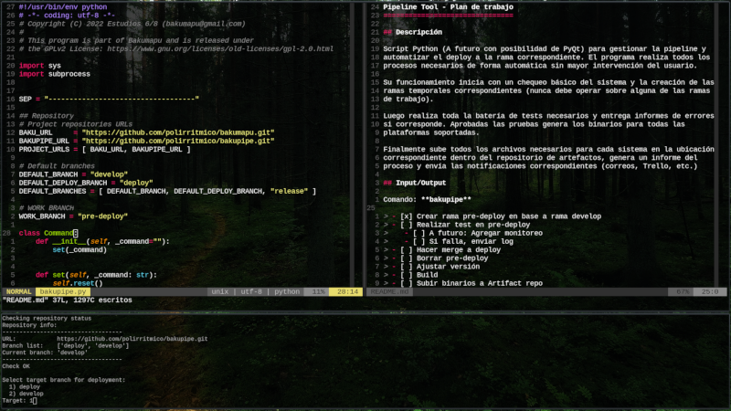

BakuPipe :factory::calling:
===========================

## Descripción

Script Python (ToDo: PyQt) para gestionar la pipeline y automatizar el deploy a
la rama correspondiente. El programa realiza todos los procesos necesarios de
forma automática sin mayor intervención del usuario.

Su funcionamiento inicia con un chequeo básico del sistema y la creación de las
ramas temporales correspondientes (nunca debe operar sobre alguna de las ramas
de trabajo).

Luego realiza toda la batería de tests necesarios y entrega informes de errores
si corresponde. Aprobadas las pruebas genera los binarios para todas las
plataformas soportadas.

Finalmente sube todos los archivos necesarios para cada sistema en la ubicación
correspondiente dentro del repositorio de artefactos, genera un informe del
proceso y envía las notificaciones correspondientes (correos, Trello, etc.)

## Input/Output

Comando: **bakupipe**

> - [x] Crear rama pre-deploy en base a rama develop
> - [ ] Realizar test en pre-deploy
>    - [ ] A futuro: Agregar monitoreo
>    - [ ] Si falla, enviar log
> - [ ] Hacer merge a deploy
> - [ ] Borrar pre-deploy
> - [ ] Ajustar versión
> - [ ] Build
> - [ ] Subir binarios a Artifact repo
> - [ ] Generar logs
>    - [ ] Enviar correos-informes

